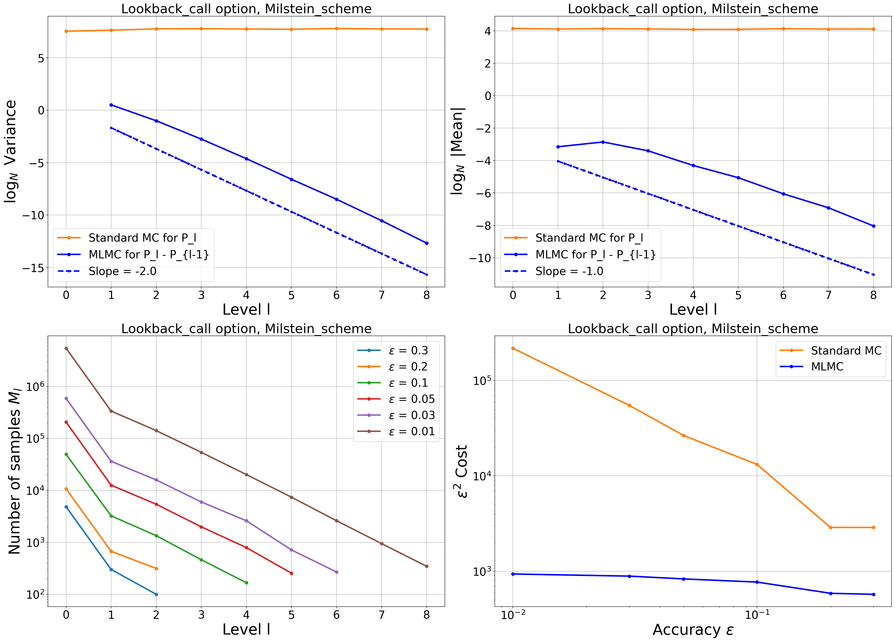

# Multilevel Monte Carlo for Option Pricing
 
A Python implementation of the Multilevel Monte Carlo (MLMC) method for pricing European, Asian, Lookback and Digital options, under both the Black-Scholes and the Heston models.
 
## What MLMC does
 
Pricing an option by Monte Carlo means averaging a payoff $f(S_T)$ over many simulated paths of an SDE
 
$$
dS_t = a(S_t, t) dt + b(S_t, t) dW_t,    S_0 = s_0,
$$
 
which is solved numerically with a discretisation step $h$. The mean squared error splits into a variance part and a bias part,
 
$$
MSE \approx c_1 M^{-1} + c_2 h^2,
$$
 
so reaching an RMSE of $\epsilon$ requires $M = O(\epsilon^{-2})$ paths on a grid with $h = O(\epsilon)$, giving a total cost of $O(\epsilon^{-3})$.
 
MLMC instead uses a sequence of grids with geometrically decreasing steps $h_l = N^{-l} T, \hspace{0.1cm} l = 0, ..., L$, and writes the price on the finest grid as a telescoping sum
 
$$
\mathbb{E} [P_L] = \mathbb{E} [P_0] + \sum_{l = 1} ^L \mathbb{E} [P_l - P_{l-1}].
$$
 
Each correction term is estimated separately, and - crucially - the fine and coarse payoffs $P_l$ and $P_{l-1}$ are computed from the same Brownian path. The two approximations are then close, so $\text{Var} [P_l - P_{l-1}]$ decays with the level and only a few samples are needed on the expensive fine grids, while the cheap coarse levels carry most of the sampling. The cost drops to $O(\epsilon^{-2})$ or $O(\epsilon^{-2}(\log \epsilon)^2)$, depending on how fast that variance decays.
 
That decay rate is the quantity that matters. Writing $\text{Var} [P_l - P_{l-1}] = O(h_l ^{\beta})$, the complexity is governed by $\beta$: for Lipschitz payoffs depending only on grid points, $\beta = 2 \gamma$ where $\gamma$ is the strong convergence order of the scheme, so the Milstein scheme ($\gamma = 1$) gives $\beta = 2$. When the payoff is path-dependent or discontinuous this relation breaks down, and recovering a good $\beta$ requires the extra treatments described below.
 
## Scalar SDE's
 
Under Black-Scholes, both the Euler-Maruyama and Milstein schemes are implemented, and four options are priced: European, Asian, Lookback and Digital. Each stresses a different assumption - a Lipschitz path-independent payoff, an average over the path, an extremum over the path, and a discontinuous terminal payoff.
 
The European option needs nothing beyond the Milstein scheme to reach $O(\epsilon^{-2})$. The Asian and Lookback options do: their payoffs depend on what the price does between grid points, which no amount of refinement at the grid points alone recovers. This is handled by a Brownian bridge construction that reconstructs the in-between behaviour - an extra integral term for the Asian average, and a conditionally sampled minimum for the Lookback. For the Digital option the discontinuity at the strike needs a different fix: the terminal payoff is replaced by its conditional expectation one step before maturity, which smooths the indicator analytically.
 
The bridge is toggled per run:
 
```python
Multilevel_MC.run(M_scheme, Asian_call_option,
                  S_0 = 100, M_in = 1000, eps = 0.001,
                  N = 2, bridge = True)
```
 
## Multidimensional SDE's
 
The Heston model adds a second, coupled process for the stochastic variance. In more than one dimension the Milstein scheme requires simulating Levy areas, for which no efficient method exists beyond two dimensions; dropping them collapses the strong order back to $\gamma = \frac{1}{2}$, and with it $\beta = 1$.
 
The implementation follows the **antithetic** construction of Giles and Szpruch, which avoids Lévy areas entirely. For each coarse step, two fine paths are simulated: one with the Brownian increments in their natural order, one with the two half-step increments swapped. The two are equal in distribution, so the estimator stays unbiased, but their errors relative to the coarse path nearly cancel, and averaging them restores $\beta = 2$ without ever simulating a Levy area.
 
Runs take an initial variance $V_0$, and the same call serves both estimators via the `antithetic` flag, which makes a like-for-like comparison straightforward:
 
```python
Multilevel_MC.run_antithetic(Milstein_Heston, European_call_option,
                             S_0 = 100, V_0 = 0.04, M_in = 1000, eps = 0.01,
                             N = 2, antithetic = True)
```
 
A practical caveat found in testing: the antithetic gain is sensitive to the model parameters, in particular to how close the Feller index $\nu = \frac{2 \kappa \theta}{\sigma^2}$ is to its critical value of 1. It is not a universal fix, and its performance is worth checking for each parameter set.
 
## Repository
 
- `MonteCarlo.py` - models (`Black_Scholes`, `Heston`), schemes (`Euler_Maruyama_scheme`, `Milstein_scheme`, `log_Heston_Milstein`), options, the `Single_level_MC` and `MLMC` algorithms, and an `Analysis` class.
- `main.py` — runs every option-scheme combination and produces the plots.
`Analysis.comprehensive_plot` gives four standard MLMC diagnostics for a run: log-variance and log-mean of the correction terms against level (with fitted slopes for $\beta$ and the weak order $\alpha$), samples per level across a range of target accuracies, and $\epsilon^2 \cdot Cost$ against $\epsilon$ compared with standard Monte Carlo.
 

 
## References
 
1. Giles, M.B. (2008). *Multilevel Monte Carlo path simulation*. Operations Research, 56(3), 607–617.
2. Giles, M.B. (2008). *Improved multilevel Monte Carlo convergence using the Milstein scheme*. Monte Carlo and Quasi-Monte Carlo Methods 2006, 343–358.
3. Giles, M.B., Szpruch, L. (2014). *Antithetic multilevel Monte Carlo estimation for multi-dimensional SDEs without Lévy area simulation*. The Annals of Applied Probability, 24(4), 1585–1620.
4. Broadie, M., Glasserman, P., Kou, S. (1997). *A continuity correction for discrete barrier options*. Mathematical Finance, 7(4), 325–348.
